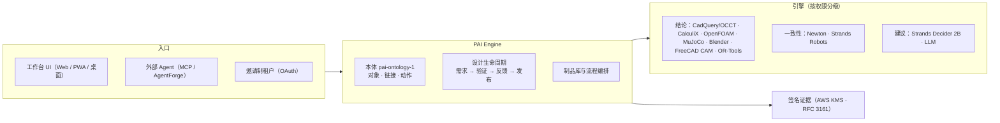

# PAI Engine

[](https://github.com/noteflowai/pai-engine/actions/workflows/ci.yml)
[](LICENSE)

**Physical AI 引擎平台：AI 提议，原生求解器裁决，结论带签名证据。**

PAI Engine 把 CAD、FEA、CFD、机器人仿真、CAM 和运筹求解器接成一个可核验的平台。模型（Kiro、Codex、Claude、Strands Decider）只能提议或建议；结论只来自原生求解器和独立核验器；修改需求、验收和发布只能由人来做。每个被采用的结果都能追溯到冻结的需求版本、求解器回执和 KMS 签名。

托管实例：<https://pai.oneai.host>（登录可见；页面左上角显示运行的版本和提交）。仓库原名 `pai-design-workbench`，2026-10-11 改名，旧地址自动跳转。

[](docs/DEMOS.md)

## 平台



| 层 | 说明 |
|---|---|
| **本体** | `pai-ontology-1`：26 个对象类型、31 个链接类型、46 个动作类型，从代码派生，契约测试防漂移；写入只能经过动作；导出 JSON Schema 与 OWL 2 + SHACL（PROV-O）。见 [ADR 0002](docs/adr/0002-physical-ai-engine-platform.md) |
| **引擎目录** | `GET /api/v1/engines`：每个引擎声明权限，只有 `verdict` 引擎能决定结论 |
| **设计工作台** | 平台上的第一个产品：需求冻结 → 候选设计 → 原生验证 → 失败回放 → 反馈复测 → 准入与签名发布 |
| **制品与流程** | 不可变、自带验收基准的算法/模型版本（第一个：场外物流规划，OR-Tools），JSON 配置的业务流程，逐节点证据与用量。见 [ADR 0001](docs/adr/0001-artifacts-and-workflows.md) |
| **对外服务** | 邀请制租户：维护者把**全部制品已发布**的流程提供给指定租户；运行按租户隔离，并发与日上限，用量按租户汇总。**不收费**。见 [API](docs/API.md#tenants-v1-invite-only) |

## 能力

| 方面 | 实现（只写跑过的结果） | 文档 |
|---|---|---|
| 几何 | CadQuery 2.8 / OCCT 7.9，两个零件族：NEMA 17 电机支架与 6202 轴承座（Ø35 H7 轴承孔、止口、射线实测壁厚、M8 地脚）；两者都可用参数预设或由 AI 写 CadQuery 代码（三层沙箱，或 AgentCore microVM），由同一套 B-Rep 检查裁决；另有 Ahmed 型车身 | [CAD_CODE.md](docs/CAD_CODE.md) |
| 结构 | Gmsh C3D10 + CalculiX 2.21，两级网格收敛；电机支架按皮带载荷算挠度和应力，轴承座按轴承余弦载荷再加测受载轴承孔失圆（底座减到 6 mm 时几何检查全过，但被 CalculiX 否决）；可在 AWS Batch 上运行（每个点一个作业，核对摘要和版本） | [PHYSICS.md](docs/PHYSICS.md) |
| 流体 | OpenFOAM v2512（固定 digest 的官方镜像）：snappyHexMesh 两级网格 + simpleFoam k-ω SST；托管站点经 Batch 运行（16 vCPU，9 分钟） | [AERO.md](docs/AERO.md) |
| 优化 | 设计空间扫描与物理寻优两个零件族都可用：GP + NSGA-II、BoTorch qLogNEHVI（支架，配对比较）；代理模型只排序，用求解数据集预热（46.3 → 44.1 g）；轴承座以受载失圆为约束，7 个实测点中最轻可行 155.3 g（参考件 189.6 g），本机或 AWS Batch 求解；推荐点必须实测并正式复核 | [PHYSICS.md](docs/PHYSICS.md) |
| 机器人 | MuJoCo 工作单元（IK、500 Hz 动力学、碰撞、节拍、10 个种子配对）；CAD 零件装到机械臂末端；导出 MJCF 和 OpenUSD（28 个 UsdValidation 校验器；Newton 1.6 交叉校验关节树、质量和正运动学） | [PHYSICS.md](docs/PHYSICS.md) |
| 产线与场景 | Blender 5.2：工作单元与 6 工位产线，BVH 射线实测通道、围栏、相机覆盖 | [PLANT.md](docs/PLANT.md) |
| 可制造性 | 三轴铣削 DFM：最少装夹方向、钻孔通道、孔深径比、紧固件可装配性（DFA）、单件成本估算；CAM：FreeCAD 1.1 + OpenCAMLib 按装夹出 G-code，另一个独立进程在 0.1 mm 高度图上仿真，检查过切、残料、过载和快移碰撞，给出节拍和仿真图；托管站点上两者各自是一个 AWS Batch 作业（一次评审 11 分钟） | [CAM.md](docs/CAM.md) |
| 证据 | EvalArc 基准对照、发布准入 5 项；AWS KMS 签名，加 RFC 3161 时间戳，只封存一次；界面内和离线核验；首件检验：按冻结公差生成检验计划，可导入 CMM 的 QIF 3.0 / CSV 报告，实测值逐项判定，随发布签名（唯一带 `physicalMeasurement: true` 的记录） | [VERIFICATION.md](docs/VERIFICATION.md) |
| AI | 受控执行器调用 Kiro（主账号 → 备用 → 二备，版本由执行器固定）、Codex 与 Claude（两者都走 Amazon Bedrock，托管站点用实例角色、不存密钥），共享账本、不自动重试，模型版本按固定 pin 核对；计划带收紧/放宽标记，确认后才执行；模型的物理估算由求解器打分；"带图问 AI"把已记录的渲染图、相机视图和应力云图按摘要发给模型（本机、托管站点和 AgentCore 均可用；盲测 6/6 与射线检查一致）；"AI 战绩"按 AI 记录被执行提案的求解器判定、人工修改、放宽尝试和估算偏差，并回传给模型用于下一次提案；模型同时能看到寻优点、FEA、DFM/CAM 和首件实测 | [AGENT_RUNTIME.md](docs/AGENT_RUNTIME.md) |
| 自主 | 维护者在总览的"AI 自主迭代"卡片里签发授权（工具、次数、有效期）、给出目标，autopilot 多轮执行"提议 → 原生检查 → 修改"；执行器无法确认副作用时停下等人核对，核对后在同一授权内继续；外部 Agent 用 `pai_run_plan` 在同一授权内触发求解。实跑：Codex 为轴承座提出参数化修正，原生检查通过（150.654 g，见 [VERIFICATION.md](docs/VERIFICATION.md)）；所有冻结要求（外形、载荷、DFM、CAM 节拍）都参与放宽判断，不能放宽要求、验收或发布 | [INDUSTRY_BENCHMARK.md](docs/INDUSTRY_BENCHMARK.md) |
| 本体与引擎 | `pai-ontology-1`：26 个对象类型、31 个链接类型、46 个动作类型，写入只能经过动作；JSON 与 OWL/SHACL 导出，对象可按链接双向读取；引擎目录标明每个引擎的权限（结论 / 一致性 / 建议）。Strands Robots 对照官方 UR5e：200 个构型法兰最大偏差 6.4 mm，据此把单元连杆质量改为官方值（29.0 → 16.99 kg，节拍与结论不变）。Strands Decider 2B 在规则解析不出工具时给出带置信度的建议（L40S 约 200 ms），只建议、不执行 | [ADR 0002](docs/adr/0002-physical-ai-engine-platform.md) · [API](docs/API.md#ontology-and-engines-v1) |
| 外部 Agent | AgentForge 会话经治理 MCP 网关使用 11 个工具（读取、提议、求解数据集、授权内执行）；工作台 `integrations/agentforge` 是唯一来源，底座用一个摘要安装 | [integrations/agentforge](integrations/agentforge/README.md) |
| 制品（物流规划） | OR-Tools 取送货车辆路径，独立核验器只用标准库：验收基准 24 单 / 5 车，OR-Tools 3 车 698 km 全部分配，顺序启发式 5 车 1538 km 漏 2 单；新环境只拿签名包、重新验收后复现相同路线。合成数据，不派车、不声称最优 | [ADR 0001](docs/adr/0001-artifacts-and-workflows.md) · [VERIFICATION](docs/VERIFICATION.md#制品平台) |
| 界面 | 响应式 Web/PWA 与 Electron 桌面版；三维视口实时显示构建；失败检查旁"问 AI"；Ctrl+K 命令面板与任务搜索；深浅色；全部页面通过 WCAG 2.1 AA；[31 个典型工业用例](docs/INDUSTRIAL_TEST_CASES.md)覆盖全部通道 | [UI_UX_BENCHMARK](docs/UI_UX_BENCHMARK.md) |

## 演示

五段真实录制的成片：机器人工作单元提速（A）、AI + Blender 产线（B）、生成式 CAD（C）、从设计到车间（D）、AI 设计轴承座（E）。完整讲解、回执与下载见 [docs/DEMOS.md](docs/DEMOS.md)。

| A · 机器人工作单元 | B · 产线布局 | D · 设计到车间 | E · AI 设计，求解器裁决 |
|---|---|---|---|
| [](docs/media/physics-demo.mp4) | [](docs/media/factory-demo.mp4) | [](docs/media/cam-demo.mp4) | [](docs/media/ai-demo.mp4) |

## 快速启动

需要 Node.js ≥ 24.21、Python 3.12、Git；Linux x86_64 可以一键安装原生工具。

```bash
npm ci && npm run setup:demo
npm run setup:native    # Blender 5.2.2 LTS（核对官方校验和）
npm run setup:cad       # CadQuery 2.8 / OCCT 7.9（哈希锁定）
npm run setup:physics   # Gmsh、CalculiX、Optuna、scikit-learn、MuJoCo、OpenUSD；加 -- --with-botorch 装 BoTorch
npm run setup:logistics # OR-Tools（哈希锁定），场外物流规划制品
npm run start           # http://127.0.0.1:4317
```

端到端检查：

```bash
npm run check           # 单元测试 + 桌面契约
npm run test:fea        # t=3 mm 几何检查通过，挠度超限被否决
npm run test:optimize   # AI 种子 + 代理模型 + 正式复核（PAI_OPTIMIZE_STRATEGY=botorch-qlognehvi 切换策略）
npm run test:robot      # MuJoCo 碰撞 → 修正；CAD 装到机械臂；MJCF / OpenUSD
npm run test:aero       # 需要 PAI_OPENFOAM_IMAGE：35° 拒绝 → 12.5° 复测通过
npm run test:cad        # B-Rep 检查、DFM
npm run test:cam        # 需要 npm run setup:cam：G-code + 独立切削仿真
npm run test:package    # 签名发布包、篡改检测
npm run test:artifacts  # 制品库 → 流程 → 签名包 → 新环境复现；不可行、超时、篡改、结构错误
npm run test:suite      # 典型工业设计用例
npm run test:browser
```

配置见 [.env.example](.env.example)，本机配置写在 `.state/demo.env`。提示词、SQLite、证据包和凭据只保存在被 Git 忽略的 `.state`。服务默认只绑定 loopback；托管部署和登录见 [DEPLOYMENT.md](docs/DEPLOYMENT.md)。

## 原则与边界

- **结论只来自原生求解器**：模型输出只能成为计划、种子或建议（`authority: none`）；代理模型只排序。
- **不确定就不重放**：结果未知的原生或模型运行等人工核对，不自动重试。
- **仿真不等于物理验证**：所有记录带 `physicalValidation: false`；唯一的实测记录是首件检验（`physicalMeasurement: true`）。
- **范围外**：认证级 FEA、疲劳、公差叠加、现场安全认证、自动发布、真实硬件控制（Strands Robots 只用仿真）、计费。

## 文档

- 使用：[API 与闭环操作](docs/API.md) · [典型测试用例](docs/INDUSTRIAL_TEST_CASES.md) · [AWS 部署与登录](docs/DEPLOYMENT.md)
- 通道：[结构与机器人](docs/PHYSICS.md) · [CAM](docs/CAM.md) · [气动](docs/AERO.md) · [产线](docs/PLANT.md) · [生成代码](docs/CAD_CODE.md)
- 设计：[整体架构（权威）](docs/SYSTEM_DESIGN.md) · [ADR 0001 制品与流程](docs/adr/0001-artifacts-and-workflows.md) · [ADR 0002 引擎平台与本体](docs/adr/0002-physical-ai-engine-platform.md) · [需求](docs/REQUIREMENTS.md) · [规划](docs/ROADMAP.md) · [实际验证记录](docs/VERIFICATION.md) · [Agent 运行时](docs/AGENT_RUNTIME.md)
- 背景：[行业对标与开源复用](docs/INDUSTRY_BENCHMARK.md) · [界面对比](docs/UI_UX_BENCHMARK.md) · [各通道设计取舍](docs/ARCHITECTURE.md) · [多端策略](docs/MULTIPLATFORM.md) · [Robot Reel 接入](docs/ROBOT_REEL_INTEGRATION.md)

本仓库新代码使用 MIT；Robot Reel 派生测试数据保留 Apache-2.0 与原始 NOTICE。见 [第三方说明](THIRD_PARTY_NOTICE.md)。
