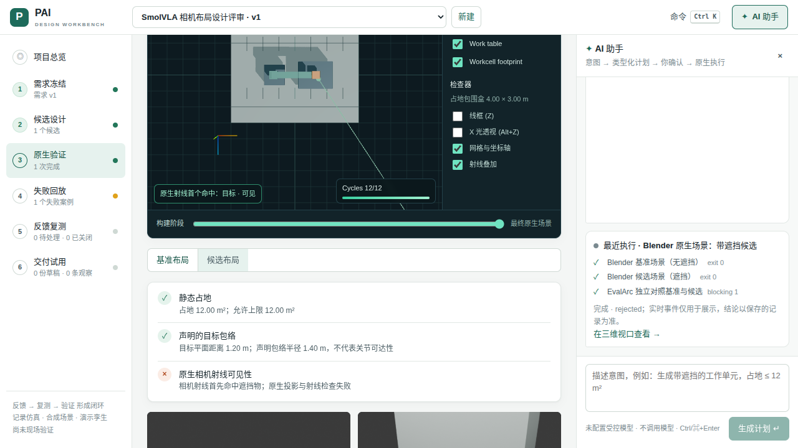
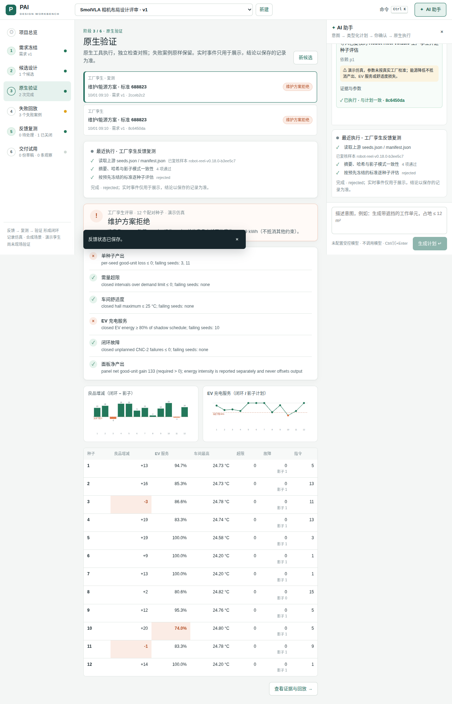

# PAI Design Workbench

TypeScript 专业设计工作台：**需求 → 候选设计 → 原生验证 → 失败回放 → 反馈复测 → 可核验交付与试用反馈**。

AWS 入口：[pai.oneai.host](https://pai.oneai.host)（管理员登录）。复用 WordPress 的同一 VPC、ALB 和 HTTPS 证书，见 [部署说明](docs/DEPLOYMENT.md)。

首个可运行场景是机器人实验设计评审。Radar 提供专业线索，领域适配器连接 Robot Reel 的真实记录核验与 EvalArc 的独立检查项对照，现有 NoteFlow 控制器保留模型预算、路由和恢复职责。


完整演示视频：[docs/media/demo.mp4](docs/media/demo.mp4)（约 2 分钟）。原生计算在录制时全程真实执行；成片只把画面静止的等待片段按 6 倍速播放，没有剪切或调换顺序。

实现了四条原生证据通道：**机器人历史记录评审**、**Blender 工作单元布局**、**CadQuery/OCCT 参数化 CAD 零件**、**工厂孪生维护与能源评审**。它们共用同一条生命周期闭环：需求冻结 → 候选设计 → 原生验证 → 失败回放 → 反馈复测 → 发布交付。需求版本只追加、可逐项比较；发布候选须通过准入检查（检查通过、绑定当前需求、失败案例均已关闭）并经维护者批准，需求修订后自动废止。底部状态栏显示原生任务、需求哈希与工具状态。左侧栏显示每个阶段的状态，总览页给出“下一步”，二者都由已保存的记录推导。

**AI 助手**停靠在右侧，把对话解析成类型化的工具计划，并标出每项约束是收紧还是放宽。计划没有验收权，只有你确认后才调用原生工具。Blender 和 CadQuery 每完成一个构建阶段，几何就通过 SSE 推送到 three.js 专业视口；视口支持轨道操作、视图预设、大纲、检查器、线框/X 光和阶段时间轴，另有 Ctrl+K 命令面板。界面为响应式 Web/PWA。[14 个典型工业设计测试用例](docs/INDUSTRIAL_TEST_CASES.md)覆盖全部通道。

不执行新的策略推理，不做 FEA、公差叠加、现场安全认证或自动发布。受控模型提案接口已实现，但实际模型调用需要现有控制器入口与经过审查的预算账本；未配置时明确禁用。

## 快速启动

要求 Node.js ≥24.21（当前最新 LTS）、npm、Python ≥3.12、Git。

```bash
npm ci
npm run setup:demo    # 下载固定版本的公开工具及原始仿真记录，约45MB记录
npm run setup:native  # Linux x86_64：最新 Blender 5.2.2 LTS，官方校验和验证
npm run setup:cad     # Python 3.12：哈希锁定的 CadQuery 2.8.0 / OCCT 7.9
npm run check
npm run test:native
npm run test:blender
npm run test:cad
npm run test:suite   # 14 个典型工业设计用例
npm run start        # http://127.0.0.1:4317
```

本工作区使用 `.state/deps` 内已验证的固定版本副本，避免跟随 Kiro 正在修改的相邻工作区。安装脚本只使用本仓库 `.state/deps`；如果既有依赖版本或工作区变化，停止并保留它们。

1. 创建任务，冻结最低成功率、保留基准和统计改善要求。
2. 选择相机偏移，执行原生检查，查看失败与配对统计。
3. 回放 seed 9：基准成功、相机失败。即使总成功数增加，也应拒绝不符合保留要求的方案。
4. 记录反馈，依次复现、分配、提出回退、回退基准并复测、关闭。
5. 下载证据包；重新上传验证，或执行以下命令在临时目录再次调用 EvalArc。
6. 生成试用案例草稿，手动记录实际试用事件。系统不发送邀请。

Blender 案例：生成带遮挡的工作单元，查看原生射线失败与 EvalArc 对照；记录遮挡反馈，保持原几何约束移除遮挡，重新生成与检查后关闭反馈。可下载可编辑 `.blend`、GLB 和原生检查。合成静态场景不是测量得到的工厂孪生。

```bash
npm run verify:bundle -- .state/evidence/camera-bundle.json
PAI_BROWSER=/path/to/google-chrome npm run test:browser
# 或：npx playwright install chromium && npm run test:browser
```

## 实际验证

原生端到端检查通过：基准 **5/10**、相机 **7/10**，相机仍丢失 **1** 个基准成功样本；Holm 调整 p=**1**，不支持总体显著改善。严格保留基准要求下拒绝相机方案，回退基准后重新核验并关闭 seed 9 反馈。原生 EvalArc 对相机返回退出码 1，表示检测到回归，不是流水线错误。

证据见 [验证报告](docs/VERIFICATION.md)。维护者验证、测试夹具和独立试用分别计量。没有独立试用或曝光分母时，独立采用数保持 0，转化率保持未知。

[云端 CI 已通过](https://github.com/noteflowai/pai-design-workbench/actions/runs/36723476548)：最新 Node LTS 验证完整原生与浏览器链路，最新 Current 验证构建、17 组边界测试和原生记录闭环；CDK 基础设施检查也通过。详见报告中的环境与范围。



工厂孪生：先冻结标准，再逐种子评估 Robot Reel v0.18.0 的真实结果；默认标准下 seed 3、11 产出下降、seed 10 EV 服务 74%，方案被拒绝。



## 工具边界

| 环节 | 实现与职责 |
|---|---|
| 专业研究 | Radar 原始快照、来源链接、来源自报等级与日期；不直接决定验收 |
| 领域设计 | 冻结需求、比较条件；Blender 原生场景、射线/投影与几何检查；参数化 CAD/动力学待接入 |
| 运行控制 | NoteFlow 原生 text-proposal flow；使用既有预算账本，不初始化或重置预算 |
| 原生验收 | Robot Reel 核验记录与配对统计；生成稳定种子 ID 的 JUnit，交由 EvalArc 对照 |
| AI 工作室 | 确定性意图解析为 Zod 校验的计划；确认后走同一 API；受控模型仅作为显式计划步骤 |
| 工厂孪生 | Robot Reel v0.18.0 逐字节 seeds/manifest；预冻结标准、摘要重算、逐种子保留；不执行上游工具 |
| 参数化 CAD | CadQuery 2.8 / OCCT 7.9 受控配方；STEP/STL/GLB/SVG；B-Rep 实测接口、壁厚、孔边距、质量与装配干涉；STEP 重导入核对 |
| 回放与交付 | 与已核验 manifest 匹配的原始视频；8 文件证据包、哈希与语义核验 |
| 推广反馈 | 案例草稿、匿名事件、反馈状态及新复测回执；不自动发送或发布 |

## 配置

参见 [.env.example](.env.example)。通过 shell 环境设置，或将本地配置写入 `.state/demo.env`。原始提示词、提案、SQLite、导出包与私人控制器路径均保存在被 Git 忽略的 `.state`。

```bash
export PAI_CONTROL_ROOT=/absolute/path/to/noteflow-agent-control
export PAI_CONTROLLER_ENTRYPOINT=/absolute/path/to/.runtime/compiled/flows/execute.js
export PAI_CONTROLLER_DATABASE=/absolute/path/to/existing-reviewed-ledger.sqlite3
```

提案端点不授予验收或发布权限；未知效果返回 `reconcile`，不会自动重试。未连接时仍可完成记录评审。`budget-status` 是只读会计观察，不是对验证命令的预算预留。

默认服务绑定 loopback，拒绝外部 Host 与跨源写入。AWS 模式配置精确 HTTPS Origin，并验证指定 ALB 的 Cognito 登录令牌；面向单个管理工作区，没有用户间数据隔离或匿名公开上传功能。部署复用 WordPress 的 VPC 与 ALB，见 [AWS 部署说明](docs/DEPLOYMENT.md)。

## 开发

```bash
npm run typecheck
npm test
npm run build
npm run test:native
npm run test:browser
```

TypeScript 7.0.2 与当前稳定依赖锁定在 `package-lock.json`。Node 24.21 LTS 与 26.10 Current 在 CI 检查；Blender 5.2.2 使用官方校验和验证。原生依赖固定在安装脚本中，升级需要重新通过原生和浏览器检查。

- [主流工业设计软件界面对比](docs/UI_UX_BENCHMARK.md)
- [工业设计典型测试用例](docs/INDUSTRIAL_TEST_CASES.md)
- [系统设计与取舍](docs/ARCHITECTURE.md)
- [API 与闭环操作](docs/API.md)
- [后续领域接入和试用计划](docs/NEXT.md)
- [主流工业软件与开源方案](docs/INDUSTRIAL_SOFTWARE.md)
- [多端与最新版本策略](docs/MULTIPLATFORM.md)
- [AWS 部署、登录与备份](docs/DEPLOYMENT.md)
- [Robot Reel Factory Twin 最新复核与接入分工](docs/ROBOT_REEL_INTEGRATION.md)

本仓库新代码使用 MIT；Robot Reel 派生测试数据保留 Apache-2.0 与原始 NOTICE。见 [第三方说明](THIRD_PARTY_NOTICE.md)。
