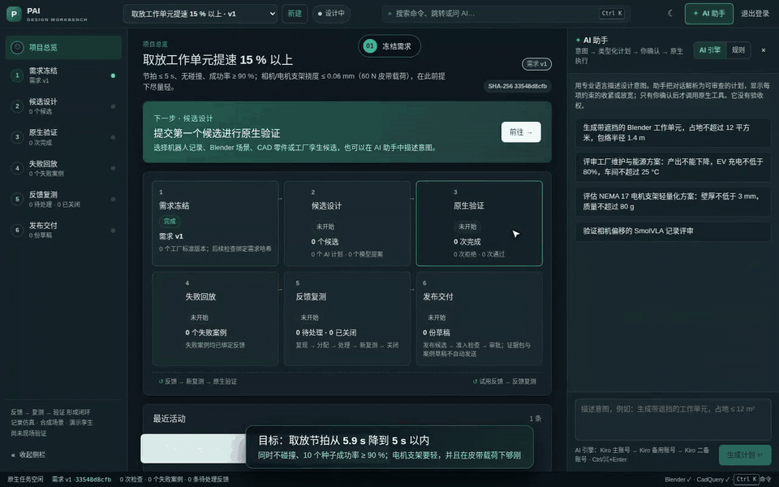
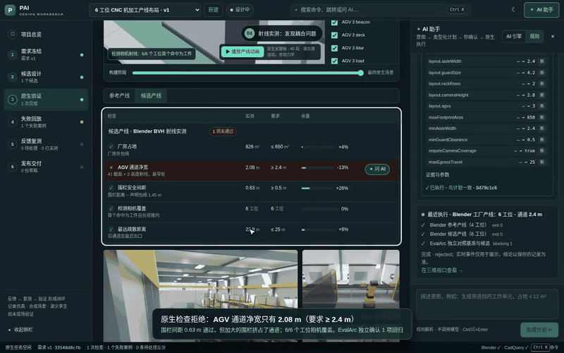
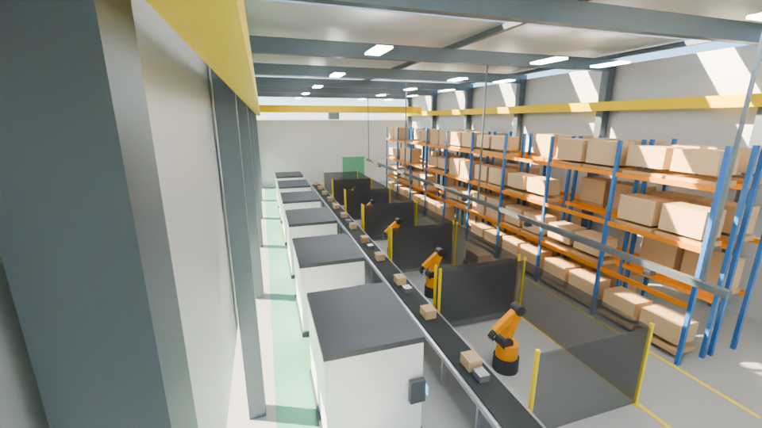
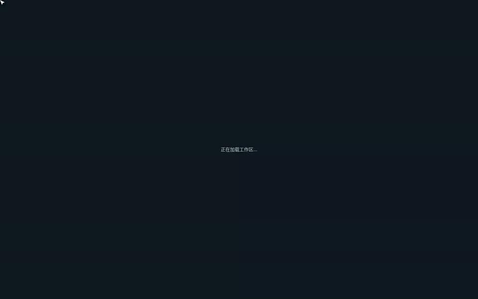
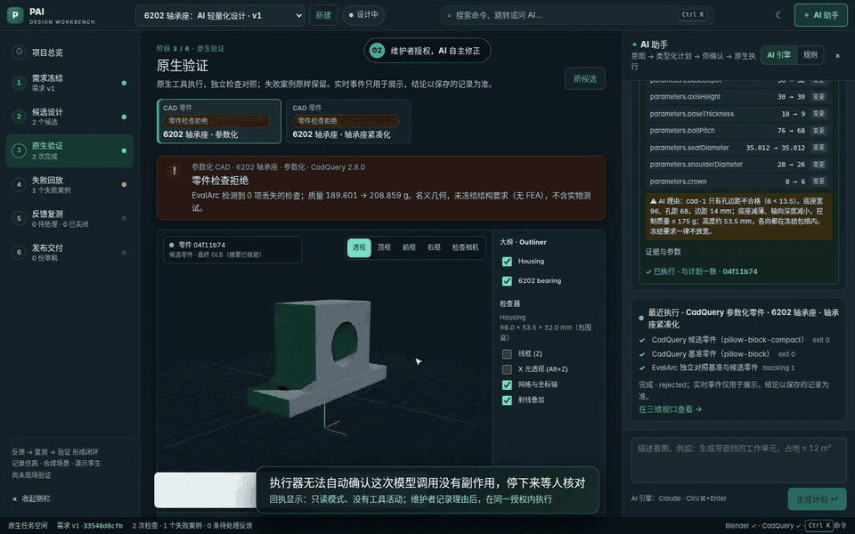
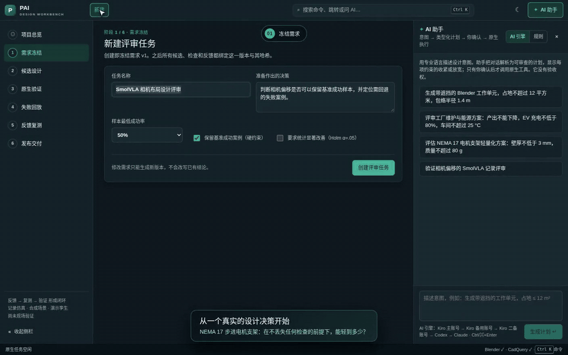

# PAI Engine

Physical AI 引擎平台（仓库原名 `pai-design-workbench`，2026-10-11 改名；旧地址自动跳转）。架构见 [ADR 0002](docs/adr/0002-physical-ai-engine-platform.md)：本体、引擎目录、Strands Robots、Strands Decider。设计工作台是平台上的第一个产品：

Physical AI 与工业设计的**可核验设计决策**工作台。AI 提出方案，并可在维护者签发的授权内自主执行原生求解；结论只由原生求解器给出，修改需求、验收和发布只能由人来做：需求冻结 → 候选设计 → 原生验证 → 失败回放 → 反馈复测 → 准入与签名发布。每个被采用的设计都能追溯到冻结的需求版本、求解器实测和签名证据。

[](docs/media/physics-demo.mp4)

**演示 A · 机器人工作单元提速，AI 设计、物理求解器裁决**：[docs/media/physics-demo.mp4](docs/media/physics-demo.mp4)（约 5.5 分钟，1280×800）。在 pai.oneai.host 上实时录制，也可以在 [GitHub Release](https://github.com/noteflowai/pai-engine/releases/tag/demo-physics-2026-10-03) 下载。

1. 目标是节拍 ≤ 5 s（参考单元 5.9 s）。初版把关节速度提到 75 %、围栏内收到 0.12 m。MuJoCo 跑了 10 个种子：节拍 4.6 s 达标，但每个种子肘部都撞到围栏，EvalArc 判定候选丢失了基准通过的检查，结论为拒绝。
2. 在失败的检查上点“问 AI”。Kiro 2.27.1（claude-opus-5.5）引用 scene-1，把围栏退回 0.30 m，速度保持不变，没有放宽任何要求。复测 4 项全部通过：节拍 4.6 s，比参考单元快 22 %，10/10 个种子成功。失败案例通过绑定的复测关闭。
3. 电机支架冻结结构要求（60 N 皮带载荷、挠度 ≤ 0.06 mm）。只看几何时最轻的 t = 3 mm 能通过 7 项几何检查，但 CalculiX 实测挠度为 0.095 mm，被否决。
4. AI 按第一性原理提出 3 个种子并附上挠度估算。实测 19 个点，其中 7 个可行；最轻的可行点由代理模型的 exploit 步骤找到：t 3.67、W 60.05、H 49.53，46.9 g，挠度 0.058 mm。正式复核 9/9 通过。AI 的 3 个种子都略超限，求解器给它们打分，挠度估算偏低 10–14 %。
5. 两条反馈都已关闭，准入 5/5，R1 发布。在界面里核验签名：AWS KMS ECDSA P-256，20 个原生文件的摘要一致。

回执见 [physics-demo.json](docs/evidence/physics-demo.json)。

英文讲解版（约 50 s，用于英文演讲）：`python3 tools/english_cut.py docs/evidence/physics-demo.en-cut.json physics-demo.en.mp4`。只做裁切和加速（画面上标出倍速），英文字幕里的数字从回执读出，不手写。

[](docs/media/factory-demo.mp4)

**演示 B · AI + Blender 设计工厂产线**：[docs/media/factory-demo.mp4](docs/media/factory-demo.mp4)（约 5 分钟，1280×800），也可以在 [GitHub Release](https://github.com/noteflowai/pai-engine/releases/tag/demo-factory-2026-10-03) 下载。

1. 用一句话描述 6 工位 CNC 机加工产线（围栏加大到 4.2 m、AGV 通道 2.4 m、厂房 ≤ 650 m²），解析成类型化计划。
2. Blender 5.2 按 8 个阶段生成整座车间，实时推送到三维视口：柱网桁架、输送线、CNC 加工中心、六轴机器人、安全围栏、货架、AGV、桥式起重机和检测相机，共 181 个对象，带 Cycles 渲染和动画。
3. BVH 射线实测发现耦合问题：加大的围栏挤占了通道，净宽只有 2.08 m（要求 ≥ 2.4 m），结论为拒绝。
4. 在失败的检查上点“问 AI”，真实调用 Kiro 主账号（claude-opus-5.5）。它在不放宽任何要求的前提下把通道加宽到 2.8 m。确认后重新生成：净宽 2.48 m，厂房 641.6 m²，5 项检查全部通过。

回执见 [factory-demo.json](docs/evidence/factory-demo.json)，通道说明见 [PLANT.md](docs/PLANT.md)。



[](docs/media/cam-demo.mp4)

**演示 D · 从设计到车间**：[docs/media/cam-demo.mp4](docs/media/cam-demo.mp4)（约 3.7 分钟，1440×900），也可以在 [GitHub Release](https://github.com/noteflowai/pai-engine/releases/tag/demo-cam-2026-10-05) 下载。全程只用原生工具，不调用模型。

1. 6202 轴承座冻结需求：Ø35 H7 轴承孔（35.000–35.025）、孔四周壁厚 ≥ 5 mm、M8 地脚孔边距 ≥ 1.5 d、外形 ≤ 120 × 40 × 60 mm。
2. 候选把轴承孔加工成 Ø34.95。CadQuery 逐个特征建模，OCCT B-Rep 实测孔径低于 H7 下限，其余检查都通过；EvalArc 判定丢失 1 项检查，结论为拒绝。
3. 回到基准设计并冻结制造要求。DFM 实测 2 次装夹、0 个孔受阻（M8 螺钉头和扳手有空间）、单件成本估算 28.53 EUR。FreeCAD 1.1 CAM 按装夹各出一份 G-code，另一个独立进程只读 G-code，在 0.1 mm 高度图上仿真：无过切、无残料、无过载、无快移碰撞，节拍 78.9 min，并给出仿真图。
4. 失败案例经反馈、复测、关闭后发布 R1。签名发布包含 STEP、两份 G-code、仿真报告和仿真图，车间拿到的程序与评审过的是同一份字节。

录制时发现并修正了 3 个问题（轴承座检查不能登记反馈、复测误用支架基准、构建中标题写成支架），回执见 [cam-demo.json](docs/evidence/cam-demo.json)。

[](docs/media/ai-demo.mp4)

**演示 E · AI 设计轴承座，求解器裁决**：[docs/media/ai-demo.mp4](docs/media/ai-demo.mp4)（约 4 分钟，1440×900），也可以在 [GitHub Release](https://github.com/noteflowai/pai-engine/releases/tag/demo-ai-2026-10-06) 下载。

1. 紧凑化轴承座（底座 88 mm、孔距 76 mm）的地脚孔边距只有 6 mm（要求 ≥ 13.5 mm），被 B-Rep 实测拒绝。
2. 维护者在总览签发授权（只允许 CAD 评审、最多 3 次）并给出目标。真实模型 Claude 经受控执行器和共享账本被调用一次。执行器无法自动确认模型调用没有副作用，停下等人核对；维护者记录理由后，在同一授权内执行。
3. AI 修好了孔边距（14 mm），但把轴承座厚度从 20 mm 加到 30 mm，并估计质量不超过 170 g。CadQuery 实测 208.9 g，超过 175 g 的上限，被否决：结论来自求解器，不来自模型。
4. 冻结 1 kN 上拔轴承载荷后做物理寻优：15 次 CalculiX 求解、10 个可行点，最轻 145.3 g，受载失圆 5.94 µm（上限 6 µm）；两级网格正式复核通过。
5. AI 战绩记录了这次被否决的提案；最初的失败经反馈、复测、关闭后发布 R1 并签名。

同一晚的前一次录制里，Claude 的提案被接受（137.957 g）；只因字幕把引擎写成了 "default" 才重录。两次结果都是真实的，回执与说明见 [ai-demo.json](docs/evidence/ai-demo.json)。

英文讲解版（约 110 s，用于英文演讲）：`python3 tools/english_cut.py docs/evidence/ai-demo.en-cut.json ai-demo.en.mp4`。只做裁切和加速（画面上标出倍速），英文字幕里的数字从回执读出，不手写。

**演示 C · 生成式 CAD**：

[](docs/media/demo.mp4)

完整视频：[docs/media/demo.mp4](docs/media/demo.mp4)（约 3 分钟，1280×800），也可以在 [GitHub Release](https://github.com/noteflowai/pai-engine/releases/tag/demo-2026-10-02) 下载。

视频里的全部结果都是录制时实时产生的：
1. NEMA 17 支架轻量化，板厚 4 → 2.5 mm，被原生检查拒绝。
2. 在“最小壁厚”这一行点“问 AI”，真实调用 Kiro 主账号（claude-opus-5.5），由它写出 CadQuery 代码。
3. 代码在三层沙箱中建模，通过全部 7 项检查，39.6 g。
4. 16 点原生设计空间扫描，找到最轻的可行设计 t = 3 mm，37.4 g，作为正式候选也通过了检查。

五段成片都没有剪切或调换顺序，只把画面静止的等待片段加速播放。CAD 演示的回执见 [demo.json](docs/evidence/demo.json)。

## 能力一览

| 方面 | 实现（只写跑过的结果） | 文档 |
|---|---|---|
| 几何 | CadQuery 2.8 / OCCT 7.9，两个零件族：NEMA 17 电机支架与 6202 轴承座（Ø35 H7 轴承孔、止口、射线实测壁厚、M8 地脚）；两者都可用参数预设或由 AI 写 CadQuery 代码（三层沙箱，或 AgentCore microVM），由同一套 B-Rep 检查裁决；另有 Ahmed 型车身 | [CAD_CODE.md](docs/CAD_CODE.md) |
| 结构 | Gmsh C3D10 + CalculiX 2.21，两级网格收敛；电机支架按皮带载荷算挠度和应力，轴承座按轴承余弦载荷再加测受载轴承孔失圆（底座减到 6 mm 时几何检查全过，但被 CalculiX 否决）；可在 AWS Batch 上运行（每个点一个作业，核对摘要和版本） | [PHYSICS.md](docs/PHYSICS.md) |
| 流体 | OpenFOAM v2512（固定 digest 的官方镜像）：snappyHexMesh 两级网格 + simpleFoam k-ω SST；托管站点经 Batch 运行（16 vCPU，9 分钟） | [AERO.md](docs/AERO.md) |
| 优化 | 设计空间扫描与物理寻优两个零件族都可用：GP + NSGA-II、BoTorch qLogNEHVI（支架，配对比较）；代理模型只排序，用求解数据集预热（46.3 → 44.1 g）；轴承座以受载失圆为约束，7 个实测点中最轻可行 155.3 g（参考件 189.6 g），本机或 AWS Batch 求解；推荐点必须实测并正式复核 | [PHYSICS.md](docs/PHYSICS.md) |
| 机器人 | MuJoCo 工作单元（IK、500 Hz 动力学、碰撞、节拍、10 个种子配对）；CAD 零件装到机械臂末端；导出 MJCF 和 OpenUSD（28 个 UsdValidation 校验器；Newton 1.6 交叉校验关节树、质量和正运动学） | [PHYSICS.md](docs/PHYSICS.md) |
| 产线与场景 | Blender 5.2：工作单元与 6 工位产线，BVH 射线实测通道、围栏、相机覆盖 | [PLANT.md](docs/PLANT.md) |
| 可制造性 | 三轴铣削 DFM：最少装夹方向、钻孔通道、孔深径比、紧固件可装配性（DFA）、单件成本估算；CAM：FreeCAD 1.1 + OpenCAMLib 按装夹出 G-code，另一个独立进程在 0.1 mm 高度图上仿真，检查过切、残料、过载和快移碰撞，给出节拍和仿真图；托管站点上两者各自是一个 AWS Batch 作业（一次评审 11 分钟） | [CAM.md](docs/CAM.md) |
| 证据 | EvalArc 基准对照、发布准入 5 项；AWS KMS 签名，加 RFC 3161 时间戳，只封存一次；界面内和离线核验；首件检验：按冻结公差生成检验计划，可导入 CMM 的 QIF 3.0 / CSV 报告，实测值逐项判定，随发布签名（唯一带 `physicalMeasurement: true` 的记录） | [VERIFICATION.md](docs/VERIFICATION.md) |
| AI | 受控执行器调用 Kiro（主账号 → 备用 → 二备，版本由执行器固定）、Codex 与 Claude（两者都走 Amazon Bedrock，托管站点用实例角色、不存密钥），共享账本、不自动重试，模型版本按固定 pin 核对；计划带收紧/放宽标记，确认后才执行；模型的物理估算由求解器打分；"带图问 AI"把已记录的渲染图、相机视图和应力云图按摘要发给模型（本机、托管站点和 AgentCore 均可用；盲测 6/6 与射线检查一致）；"AI 战绩"按 AI 记录被执行提案的求解器判定、人工修改、放宽尝试和估算偏差，并回传给模型用于下一次提案；模型同时能看到寻优点、FEA、DFM/CAM 和首件实测 | [AGENT_RUNTIME.md](docs/AGENT_RUNTIME.md) |
| 自主 | 维护者在总览的"AI 自主迭代"卡片里签发授权（工具、次数、有效期）、给出目标，autopilot 多轮执行"提议 → 原生检查 → 修改"；执行器无法确认副作用时停下等人核对，核对后在同一授权内继续；外部 Agent 用 `pai_run_plan` 在同一授权内触发求解。实跑：Codex 为轴承座提出参数化修正，原生检查通过（150.654 g，见 [VERIFICATION.md](docs/VERIFICATION.md)）；所有冻结要求（外形、载荷、DFM、CAM 节拍）都参与放宽判断，不能放宽要求、验收或发布 | [INDUSTRY_BENCHMARK.md](docs/INDUSTRY_BENCHMARK.md) |
| 本体与引擎 | `pai-ontology-1`：25 个对象类型、30 个链接类型、42 个动作类型，写入只能经过动作；JSON 与 OWL/SHACL 导出，对象可按链接双向读取；引擎目录标明每个引擎的权限（结论 / 一致性 / 建议）。Strands Robots 对照官方 UR5e：200 个构型法兰最大偏差 6.4 mm，据此把单元连杆质量改为官方值（29.0 → 16.99 kg，节拍与结论不变）。Strands Decider 2B 在规则解析不出工具时给出带置信度的建议（L40S 约 200 ms），只建议、不执行 | [ADR 0002](docs/adr/0002-physical-ai-engine-platform.md) · [API](docs/API.md#ontology-and-engines-v1) |
| 外部 Agent | AgentForge 会话经治理 MCP 网关使用 11 个工具（读取、提议、求解数据集、授权内执行）；工作台 `integrations/agentforge` 是唯一来源，底座用一个摘要安装 | [integrations/agentforge](integrations/agentforge/README.md) |

## 制品库与流程编排

PAI 交付的是可独立核验的**制品**：算法和模型按不可变版本登记，经自身基准验收、人工发布后，才能被 JSON 配置的业务流程引用；每次运行逐节点留下产物、证据和用量（原生计算与模型 Token 分开记录，量不出来记 `unknown`），签名包可以在另一个环境核验并复现。第一个制品是**场外物流规划**（OR-Tools 取送货车辆路径：载重、先取后送、时间窗、班次），由只用标准库的独立核验器裁决：

- 验收基准（24 单 / 5 车）：OR-Tools 3 辆车 698 km，全部分配；顺序启发式基线用 5 辆车 1538 km，还漏掉 2 单；
- 流程运行（40 单 / 8 车）：5 辆车 1381 km，独立核验 7 项通过，调度员确认后完成；
- 超重订单 → 不可行 → 流程拒绝；限时过短 → 超时 → 拒绝；流程结构错误、篡改包、外来代码或声明、未固定的签名者、越权访问都被拒绝；
- 新环境（新存储、新密钥、按哈希锁另装 OR-Tools）只拿包文件，重新验收后复现出相同路线。

```bash
npm run setup:logistics && npm run test:artifacts   # 界面：#/artifacts
```

合成数据，不派车、不计费，不声称最优或生产收益。设计与选型见 [ADR 0001](docs/adr/0001-artifacts-and-workflows.md)，结果见 [VERIFICATION.md](docs/VERIFICATION.md#制品平台)。

界面是响应式 Web/PWA 加 Electron 桌面版：三维视口实时显示构建阶段，每个失败检查旁都有"问 AI"，Ctrl+K 命令面板，深浅色主题，全部页面通过 WCAG 2.1 AA 检查。[31 个典型工业设计用例](docs/INDUSTRIAL_TEST_CASES.md)覆盖全部通道。

范围外：认证级 FEA、疲劳、公差叠加、现场安全认证、自动发布。仿真不等于物理验证，所有记录都带 `physicalValidation: false`。

## 快速启动

需要 Node.js ≥ 24.21、Python 3.12、Git；Linux x86_64 可以一键安装原生工具。

```bash
npm ci && npm run setup:demo
npm run setup:native    # Blender 5.2.2 LTS（核对官方校验和）
npm run setup:cad       # CadQuery 2.8 / OCCT 7.9（哈希锁定）
npm run setup:physics   # Gmsh、CalculiX、Optuna、scikit-learn、MuJoCo、OpenUSD；加 -- --with-botorch 装 BoTorch
npm run setup:logistics # OR-Tools（哈希锁定），场外物流规划制品
npm run start           # http://127.0.0.1:4317
```

端到端检查：

```bash
npm run check           # 单元测试 + 桌面契约
npm run test:fea        # t=3 mm 几何检查通过，挠度超限被否决
npm run test:optimize   # AI 种子 + 代理模型 + 正式复核（PAI_OPTIMIZE_STRATEGY=botorch-qlognehvi 切换策略）
npm run test:robot      # MuJoCo 碰撞 → 修正；CAD 装到机械臂；MJCF / OpenUSD
npm run test:aero       # 需要 PAI_OPENFOAM_IMAGE：35° 拒绝 → 12.5° 复测通过
npm run test:cad        # B-Rep 检查、DFM
npm run test:cam        # 需要 npm run setup:cam：G-code + 独立切削仿真
npm run test:package    # 签名发布包、篡改检测
npm run test:artifacts  # 制品库 → 流程 → 签名包 → 新环境复现；不可行、超时、篡改、结构错误
npm run test:suite      # 典型工业设计用例
npm run test:browser
```

配置见 [.env.example](.env.example)，本机配置写在 `.state/demo.env`。提示词、SQLite、证据包和凭据只保存在被 Git 忽略的 `.state`。服务默认只绑定 loopback；托管部署和登录见 [DEPLOYMENT.md](docs/DEPLOYMENT.md)。

## 文档

- 使用：[API 与闭环操作](docs/API.md) · [典型测试用例](docs/INDUSTRIAL_TEST_CASES.md) · [AWS 部署与登录](docs/DEPLOYMENT.md)
- 通道：[结构与机器人](docs/PHYSICS.md) · [CAM](docs/CAM.md) · [气动](docs/AERO.md) · [产线](docs/PLANT.md) · [生成代码](docs/CAD_CODE.md)
- 设计：[整体架构（权威）](docs/SYSTEM_DESIGN.md) · [ADR 0001 制品与流程](docs/adr/0001-artifacts-and-workflows.md) · [ADR 0002 引擎平台与本体](docs/adr/0002-physical-ai-engine-platform.md) · [需求](docs/REQUIREMENTS.md) · [规划](docs/ROADMAP.md) · [实际验证记录](docs/VERIFICATION.md) · [Agent 运行时](docs/AGENT_RUNTIME.md)
- 背景：[行业对标与开源复用](docs/INDUSTRY_BENCHMARK.md) · [界面对比](docs/UI_UX_BENCHMARK.md) · [各通道设计取舍](docs/ARCHITECTURE.md) · [多端策略](docs/MULTIPLATFORM.md) · [Robot Reel 接入](docs/ROBOT_REEL_INTEGRATION.md)

本仓库新代码使用 MIT；Robot Reel 派生测试数据保留 Apache-2.0 与原始 NOTICE。见 [第三方说明](THIRD_PARTY_NOTICE.md)。
