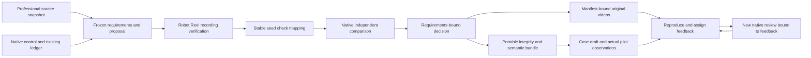
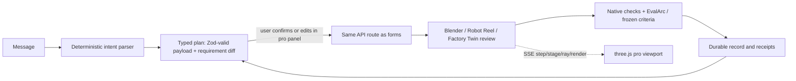

# Architecture decision: domain workbench with native evidence

The workbench owns domain records and a local UI. It does not replace the control plane's workflow engine, providers or accounting.

## Durable identity and fail-closed execution

SQLite records a request claim and running domain record in one transaction. Same request/input returns the saved identity without launching native commands again. Different input under the same identity conflicts. On restart, pending reviews/proposals become interrupted and retain their identity; no automatic replay.

Each review freezes the project revision and requirement hash. Native input and verifier hashes are compared before and after checking, including the independent comparison. Two different review IDs generate output in separate private directories. Native commands use fixed executables and argv without a shell; the HTTP API accepts no path, command, cwd, Python path or output directory.

Robot Reel remains the recording verifier. The adapter invokes `python3 -B -m robot_reel.cli stress ... --paired-exact`. TypeScript validates native structure, condition coverage, unique paired seeds, equal baseline identity, totals and exact paired statistics. It maps each seed outcome into JUnit with a stable classname/name. EvalArc independently detects checks losing passes. Total success rate alone cannot erase a known failing seed.

Acceptance is explicit: minimum recorded success, optional preservation of baseline successes, optional Holm-adjusted significant improvement. Turning off preservation is a different frozen requirement, not changing the native regression gate. Accepted means accepted within the recorded panel. Reference is never described as an improved policy.

## Feedback is a domain state machine

Required path: received → reproducible → assigned → resolution → rechecked → closed. A regression must identify a seed that actually lost a baseline success. A fix recheck must be a new completed run tied to the same feedback and current project revision, and the reported seed must pass. Changing requirements after recheck prevents closing the obsolete result. A documented no-change resolution is available via API; it still needs a bound recheck.

This small domain state machine does not schedule providers, manage retries or replace acpx. Controller routing remains in the existing native flow. A model answer is a proposal with no acceptance/publication authority. Missing configuration disables invocation; the workbench never creates a replacement budget ledger. Unknown effects remain reconciliations.

## Replay and handoff

Video requests require a completed review, the exact source manifest hash, and the video's own original hash. Paths are constructed from closed candidate/view enums and seed 0–9. Range responses allow real browser decoding. A modified source cannot silently serve under an old review.

The portable packet includes eight text files: review, native recording result, native comparison, Radar snapshot, baseline/current JUnit, case text and source digests. Verification checks the closed file set, byte limits, hashes, requirement identity, exact outcomes, regenerated JUnit and decision semantics. The CLI also re-executes native EvalArc in a fresh temporary directory and compares stable changes.

**Integrity is not source authentication.** A self-consistent packet has no independent signature or timestamp authority. Videos remain in the original Robot Reel bundle; this text packet does not recreate simulation physics. Consumers needing stronger provenance must receive the licensed original source bundle, pinned tools and a trusted signer independently.

## Interface and operational scope

Fastify / React / Vite / Zod / TypeScript; private SQLite with WAL and full synchronization. API writes reject cross-origin requests, workspace requests require a configured Host, uploads are bounded, CSP forbids foreign scripts, and runtime state is excluded from Git.

Local trusted operators configure dependency paths through environment variables. AWS mode adds a shared ALB host route, Cognito login and application verification of signed claims from that ALB, issuer and client. Only the ALB security group reaches the instance. A dedicated encrypted EBS volume holds state and artifacts; daily AWS Backup retention is 14 days.

Long native work is claimed durably before returning HTTP 202. Clients poll the existing run; duplicate identities never relaunch it. Graceful shutdown waits for active native jobs, while forced restarts retain interrupted identities. Shared WordPress listener rules and idle timeout are unchanged.

The deployment has one management workspace. It does not isolate data between users, schedule publication or accept anonymous public uploads. Native desktop/mobile packaging remains future work.

## AI-native interaction inside professional contracts

The studio follows the pattern used by feature-level CAD agents (for example SolidPilot's intent IR and deterministic compiler) and copilot panels docked beside the model: the conversation produces an intermediate representation, a deterministic layer executes it, and native checks decide.

- Plans have `authority: none`. Relaxations are labelled and create a new frozen version; old verdicts stay unchanged.
- Confirmation records whether the executed payload matched the plan or was edited first.
- A model is used only as an explicit `model-proposal` step through the existing controller and reviewed ledger. Otherwise no model call happens.
- The same live session feeds from chat actions and classic buttons, so both paths look and behave the same.

**Live native viewport.** The Blender script exports a GLB after each construction stage and prints `PAI_EVENT` lines for stages, the native ray (converted to glTF Y-up) and Cycles `Sample n/m` from the `render_stats` handler. `command()` observes complete stdout lines without changing the retained result. Stage files are hashed into the scene record and served only if their digest matches. A bounded in-memory `LiveBus` replays events per request identity over server-sent events with 15 s heartbeats, below the shared ALB 60 s idle timeout. The viewport offers orbit, view presets (numpad-style keys), outliner visibility, inspector bounds, wireframe/X-ray, ray overlay and a stage scrubber. Events are presentation only.

**Factory Twin.** Evidence is byte-identical upstream `seeds.json` + `manifest.json` (bundled from Robot Reel `b3ee5c7`, Apache-2.0, extracted from git objects). Criteria are a separate frozen record that must exist before import. Consistency is checked by recomputing the upstream summary; acceptance is computed per seed from frozen criteria only. With default criteria the real panel is rejected: seeds 3 and 11 lose output, seed 10 delivers 74% EV service. No upstream tool is executed and the hosted Robot Reel verifier stays at `6124cee3cba5`.

## Lifecycle-first workspace

The UI is organised around the review lifecycle rather than one long page. `src/lifecycle.ts` derives, from durable records only, the status of each stage (requirements, design, validate, evidence, feedback, deliver), the retained failing cases with their bound feedback, the next step and an activity log. The rail shows each stage's status and metric; the overview shows the loop and the next step; every view is deep-linkable (`#/validate?kind=cad-part&id=…`). Validation and feedback use a master–detail layout; the docked assistant shares the same live session as the forms. Container queries follow the width of the work area, so docking the assistant never breaks the layout; at 390 px the rail becomes a horizontal stage bar and the assistant a full-screen sheet.

## Versions and release maturity

Benchmarked against Onshape versions/release candidates, 3DEXPERIENCE maturity and change actions, and Teamcenter data release (see [UI_UX_BENCHMARK.md](UI_UX_BENCHMARK.md)). Every requirement revision is snapshotted as an immutable `project-version` with its digest; the UI compares any two versions field by field. A release candidate cites one completed, passing run bound to the current revision; admission also requires every retained failing case to have closed feedback and no open feedback. A maintainer approves (re-checked at approval) or rejects with a reason; maturity is `in-review → released | rejected`, and an earlier release or any release bound to an older requirement revision becomes `superseded`. A release adopts a design decision within its evidence scope; it is never physical validation, production approval or publication.

## Parametric CAD lane

`native/cad_bracket.py` builds a NEMA 17 motor-mount bracket in CadQuery 2.8 / OCCT 7.9 from a closed variant set. It exports a staged GLB after each modelling feature, then measures the B-Rep: solid validity, pilot bore / M3 pattern / 31 mm pitch from cylindrical faces, a boolean common with the motor envelope, minimum wall from opposite planar faces and hole ligaments with material between them, edge distance from hole centres to the face outer wire, mass and envelope. The same JUnit → EvalArc comparison as the Blender lane decides regressions. CadQuery is installed into `.state/tools` from a hash-locked requirement file (`native/cadquery-requirements.txt`). Nominal geometry only.

## Why this scope first

A verifiable robotics review is feasible with existing real recordings and native checks. Mechanical CAD, DFM and industrial deployment need different native artifacts, evaluators and measurements. The contracts can support them, but labeling a generic text proposal as an industrial design solution would hide missing capabilities.
