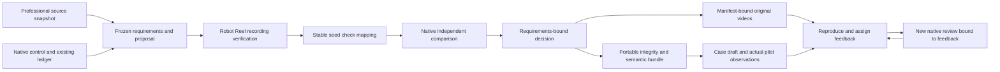

# Architecture decision: domain workbench with native evidence

The workbench owns domain records and a local UI. It does not replace the control plane's workflow engine, providers or accounting.

## Durable identity and fail-closed execution

SQLite records a request claim and running domain record in one transaction. Same request/input returns the saved identity without launching native commands again. Different input under the same identity conflicts. On restart, pending reviews/proposals become interrupted and retain their identity; no automatic replay.

Each review freezes the project revision and requirement hash. Native input and verifier hashes are compared before and after checking, including the independent comparison. Two different review IDs generate output in separate private directories. Native commands use fixed executables and argv without a shell; the HTTP API accepts no path, command, cwd, Python path or output directory.

Robot Reel remains the recording verifier. The adapter invokes `python3 -B -m robot_reel.cli stress ... --paired-exact`. TypeScript validates native structure, condition coverage, unique paired seeds, equal baseline identity, totals and exact paired statistics. It maps each seed outcome into JUnit with a stable classname/name. EvalArc independently detects checks losing passes. Total success rate alone cannot erase a known failing seed.

Acceptance is explicit: minimum recorded success, optional preservation of baseline successes, optional Holm-adjusted significant improvement. Turning off preservation is a different frozen requirement, not changing the native regression gate. Accepted means accepted within the recorded panel. Reference is never described as an improved policy.

## Feedback is a domain state machine

Required path: received → reproducible → assigned → resolution → rechecked → closed. A regression must identify a seed that actually lost a baseline success. A fix recheck must be a new completed run tied to the same feedback and current project revision, and the reported seed must pass. Changing requirements after recheck prevents closing the obsolete result. A documented no-change resolution is available via API; it still needs a bound recheck.

This small domain state machine does not schedule providers, manage retries or replace acpx. Controller routing remains in the existing native flow. A model answer is a proposal with no acceptance/publication authority. Missing configuration disables invocation; the workbench never creates a replacement budget ledger. Unknown effects remain reconciliations.

## Replay and handoff

Video requests require a completed review, the exact source manifest hash, and the video's own original hash. Paths are constructed from closed candidate/view enums and seed 0–9. Range responses allow real browser decoding. A modified source cannot silently serve under an old review.

The portable packet includes eight text files: review, native recording result, native comparison, Radar snapshot, baseline/current JUnit, case text and source digests. Verification checks the closed file set, byte limits, hashes, requirement identity, exact outcomes, regenerated JUnit and decision semantics. The CLI also re-executes native EvalArc in a fresh temporary directory and compares stable changes.

**Integrity is not source authentication.** A self-consistent packet has no independent signature or timestamp authority. Videos remain in the original Robot Reel bundle; this text packet does not recreate simulation physics. Consumers needing stronger provenance must receive the licensed original source bundle, pinned tools and a trusted signer independently.

## Interface and operational scope

Fastify / React / Vite / Zod / TypeScript; private local SQLite with WAL and full synchronization. API writes reject cross-origin requests, all requests require a local expected Host, uploads are bounded, CSP forbids foreign scripts, and local state is excluded from Git.

Local trusted operators configure dependency paths through environment variables. No multi-user authentication, scheduled publication, credential browser automation or public upload service is implied.

## Why this scope first

A verifiable robotics review is feasible with existing real recordings and native checks. Mechanical CAD, DFM and industrial deployment need different native artifacts, evaluators and measurements. The contracts can support them, but labeling a generic text proposal as an industrial design solution would hide missing capabilities.
