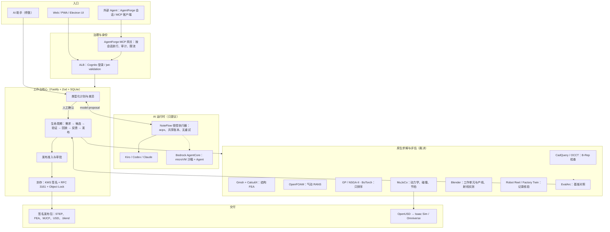

# 系统设计：PAI Design Workbench × AgentForge（2026-10-03 修订）

本文是整体架构的权威说明，[需求](REQUIREMENTS.md)和[规划](ROADMAP.md)都以它为准。分通道细节见 [ARCHITECTURE.md](ARCHITECTURE.md)、[PHYSICS.md](PHYSICS.md)、[AGENT_RUNTIME.md](AGENT_RUNTIME.md)。

## 1. 定位与核心原则

面向 Physical AI 和工业设计的**可验证设计决策系统**。要做到的是：每一个被采用的设计，都能追溯到冻结的需求、原生求解器的实测，以及签名后不可篡改的证据。

| 原则 | 含义 | 在系统里如何保证 |
| 自主有边界 | AI 可以在维护者签发的授权内多轮执行原生检查，但不能放宽要求，也不能验收或发布 | `autonomy-grant` 规定工具、次数和有效期；autopilot 与 `pai_run_plan` 共用同一套执行规则 |
| 做减法 | 每个概念只出现一次：一个来源、一个固定值、一个入口 | 集成内容只在工作台维护；底座只做安装；审批脚本两份合并成一份 |
|---|---|---|
| AI 只提议，求解器裁决 | 模型输出只能成为计划或种子，结论来自原生工具 | 计划 `authority: none`；验收只看原生检查 + EvalArc；代理模型只排序 |
| 需求先冻结 | 每次评审绑定需求版本和哈希；放宽要求会生成新版本 | `project-version` 只追加；计划差异标出收紧或放宽 |
| 失败不能被覆盖 | 失败案例必须经反馈、绑定的复测、关闭来处置 | 反馈状态机；复测必须绑定 `feedbackId`；准入 5 项 |
| 不确定就不重放 | 结果未知的原生或模型运行等人工核对 | 请求身份写入 SQLite；`reconcile` 状态；不自动重试 |
| 复用而不重造 | 能用的成熟组件直接用：求解器、acpx、网关、KMS、OpenUSD | 见第 4 节的复用矩阵 |
| 版本只登记一处 | 每个引擎或依赖只有一个固定点，其余从它派生 | `engine-pins.json`、`runtime-pins.json`、哈希锁文件 |

## 2. 分层架构

各层职责边界：
- **入口层**不持有任何结论。
- **治理层**负责身份和工具放行。
- **核心层**负责记录、状态机和准入。
- **AI 运行时**只产生文本提议。
- **原生层**给出全部实测结果。
- **交付层**只封装已发布的记录。

## 3. 与 AgentForge（底座）的融合方式

底座是 `noteflowai/agentforge`，README 自称 autoforge；`noteflowai/autoforge` 只放导出的参考应用。两者按"契约对接、不共享权威"的方式融合：

| 接缝 | 方向 | 现状 | 依据 |
|---|---|---|---|
| 引擎层 acpx | 共用同一组件，版本各自固定 | 底座 PR #548 升到 acpx 0.19.4（CodeBuild 4 条全过）；执行器 PR #53 | `base-image.lock`、`engine-pins.json` |
| 集成包（唯一来源） | 工作台 `integrations/agentforge` 维护内容（配置、技能、评测题）和 `bundle.json`；底座 `examples/pai-workbench` 只做安装：一个摘要锁定全部文件，各部分交给底座已有的机制 | 一个固定值、一条安装命令；底座不保留副本（只留测试用快照） | PR #551 |
| MCP 网关 | AgentForge 会话 → PAI 读取和提议工具 | 底座示例 PR #549：用底座自己的 `mcp-gateway/policy.mjs` 核验，8 个工具放行，审批/执行类工具拒绝 | `examples/pai-workbench`、`integrations/agentforge` |
| 托管身份 | OAuth 客户端凭据 → ALB jwt-validation → 工作台按 scope 再验一次 | 已上线（规则 119） | `src/agent-api.ts` |
| AgentCore | 两边都对接同一个托管服务 | PAI 的 sandbox 和 agent 两个 runtime 已在用 | [AGENTCORE.md](AGENTCORE.md) |
| CI/CD | 底座用 CodePipeline（`autoforge-unified`），PAI 用 GitHub Actions | 先在 CodeBuild 上验证 PR 分支再合并；生产环境的 Approve 阶段由审批 Agent 按证据判断（`scripts/approval-agent.py`，取代 drain-approvals.sh），只放行 main 顶端且部署前各阶段全部成功的提交；`:full` 已推广到 acpx 0.19.4 | `deploy/codepipeline` |
| Host 会话通道 | PAI 的规划器暂不迁到 Host | 六个闸门尚未全部满足 | [AGENT_RUNTIME.md](AGENT_RUNTIME.md) |

计划中的下一批接缝（见[规划](ROADMAP.md) M2）：
- PAI 技能经底座的技能分发机制提供：在固定提交拉取，用 `computeSkillDigest` 锁定，分发器失败即拒绝（已完成，PR #549）；
- 用底座 `eval/` 的 golden-task harness 度量模型的物理推理能力：`estimate-bracket-deflection`，评分程序放在工作区外，用 CalculiX 留出集打分（框架已完成）；
- 让 Host 的 OTel GenAI 遥测接入外部 Agent 的调用链。

## 4. 复用矩阵（不重造轮子）

下一阶段的开源复用与行业对标见 [INDUSTRY_BENCHMARK.md](INDUSTRY_BENCHMARK.md)。

| 能力 | 采用的现成组件 | 自研部分（只做胶水和契约） |
|---|---|---|
| 几何 | CadQuery 2.8 / OCCT 7.9 | 受控配方、B-Rep 检查映射 |
| 结构求解 | Gmsh 4.15 + CalculiX 2.21 | 载荷与边界条件、两级网格收敛 |
| 流体求解 | OpenFOAM v2512（OpenCFD 官方镜像，固定 digest） | Ahmed 型车身配方、算例字典、两级网格与收敛检查 |
| 优化 | Optuna 5（NSGA-II、QMC）、scikit-learn GP、BoTorch 0.18（qLogNEHVI） | 多保真筛查、校准、AI 种子打分 |
| 动力学 | MuJoCo 3.14 | 工作单元 MJCF、种子配对、CAD 工装装配 |
| 孪生格式 | OpenUSD 26.8（UsdPhysics、UsdValidation） | MuJoCo → USD 映射 |
| 场景 | Blender 5.2 | 产线配方、射线检查 |
| 回归对照 | EvalArc | 检查项到 JUnit 的映射 |
| 模型运行 | acpx、NoteFlow 执行器、Bedrock AgentCore | 提示词契约与计划校验 |
| Agent 治理 | AgentForge mcp-gateway、Cognito | 工具 allowlist 与 scope |
| 证据可信 | AWS KMS、RFC 3161（DigiCert）+ OpenSSL、S3 Object Lock | 清单规范、封存流程 |

## 5. 核心数据与状态

- **记录**：项目、需求版本、评审（场景、CAD、机器人、工厂）、寻优、反馈、发布、封存、AI 计划。全部保存在 SQLite（WAL，full sync）。只追加的记录用 `insert`；需要修改的用乐观锁 `revision`。
- **原生产物**：保存在 `.state/<lane>/<id>/`，摘要写入记录。读取时重新算摘要，不一致就拒绝。
- **请求身份**：`requestId` + 输入摘要通过 `claim` 登记。相同输入返回已有记录，不同输入报冲突。
- **发布包**：每个发布只生成一次，之后返回相同字节。KMS ECDSA P-256 签名清单，RFC 3161 时间戳覆盖签名，可选写入 Object Lock COMPLIANCE 桶。

## 6. 安全与信任边界

- **网络入口**：只开 HTTPS，WordPress 共用的 ALB 规则保持不变。Cognito 管人工登录，客户端凭据管 Agent。写请求拒绝跨源。
- **生成的代码**：经过三层隔离（AST 策略、进程锁定、无网络的 bubblewrap）；在 AgentCore 上再加 microVM。
- **IAM 最小权限**：实例只有 `kms:Sign` / `kms:GetPublicKey`，以及归档桶前缀的写入和读回权限，没有删除或绕过权限。不为恢复任务而放宽 IAM。
- **模型**：没有审批、发布、反馈或执行权限，所有提议都要人工确认。

## 7. 部署拓扑

| 环境 | 组成 |
|---|---|
| 本机 / 桌面 | 一条命令安装固定版本工具（`setup:*`）；Electron 共用同一服务 |
| 托管 pai.oneai.host | EC2 + 加密 EBS + 每日备份；CDK 管理；发布用 SSM 原子切换，保留上一版 |
| AgentCore | arm64 BYOC；sandbox 无出网；agent 的账本在 EFS |
| 求解扩展（PAISolver） | AWS Batch on Fargate（amd64，Gmsh 没有 aarch64 包）；专用 VPC，只有公有子网，没有 NAT，没有固定成本；不允许入站，只允许 HTTPS 出站；作业桶只开放 jobs/ 前缀，30 天后过期；每个点一个作业，不重试 |
| 底座 | AgentForge CodePipeline（ap-southeast-1）；基础镜像先推验证标签，看过扫描再推广 |

## 8. 决策记录

| 决策 | 结论 | 文档 |
|---|---|---|
| 规划器运行时 | NoteFlow 执行器，暂不用 AgentForge Host | [AGENT_RUNTIME.md](AGENT_RUNTIME.md) |
| 外部 Agent | 经 AgentForge MCP 网关，只能读和提议 | [MCP.md](MCP.md) |
| 代理模型的角色 | 只排序；推荐点必须实测并正式复核 | [PHYSICS.md](PHYSICS.md) |
| 证据可信 | KMS 签名 + RFC 3161 时间戳 + Object Lock；归档需显式开启 | [VERIFICATION.md](VERIFICATION.md) |
